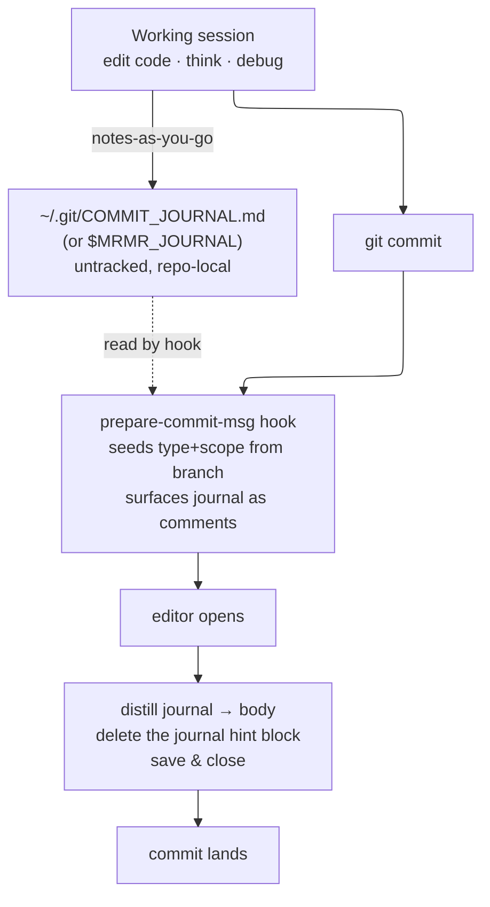

# Contributing to MurMur

This document is a *living* file. It will grow as the project does. For
v1.0 it covers commit hygiene, git workflow, and the Developer
Certificate of Origin. Code style, RFC process, and review etiquette
will be added as MurMur opens to outside contributors.

## License & DCO

MurMur is dual-licensed under Apache-2.0 OR MIT. By contributing, you
agree your work will be released under the same terms.

Contributions are accepted under the **Developer Certificate of Origin**
(<https://developercertificate.org>). Every commit must carry a
`Signed-off-by:` trailer. This repository has `format.signoff = true`
configured locally, which adds the trailer automatically — but you must
have configured your identity:

```bash
git config --local user.name  "Your Name"
git config --local user.email "you@example.com"
git config --local format.signoff true
```

CI rejects commits without a sign-off.

## Branch & PR workflow

- `main` is always green. Direct pushes are blocked.
- One change → one branch → one PR → squash-merge.
- Branch names: `<type>/<short-kebab-summary>`, optionally with a scope:
  `<type>/<scope>/<short-kebab-summary>` (e.g. `feat/grpc/streaming`).
- PR titles must be valid Conventional Commits. Commitlint enforces this.
- Squash is the only merge method. The squash-commit subject becomes
  one entry in `git log --oneline main`.

## Commit messages — the contract

A commit message in MurMur is a **deliverable**, not a chore. It is
read by:

- you, in three months, debugging
- a reviewer, today
- `git blame` callers, in three years
- changelog generators (`git-cliff`), automatically

The format is [Conventional Commits 1.0.0](https://www.conventionalcommits.org/en/v1.0.0/):

```
<type>(<scope>): <subject in imperative mood, ≤72 chars>

<body — what & why>

<considered & rejected — alternatives weighed>

<refs — issues, RFCs, ADRs>

Signed-off-by: Your Name <you@example.com>
```

### Subject

- Imperative mood: "add", not "added" or "adds"
- ≤72 chars total, including type, scope, and punctuation
- No trailing period
- Capitalize the first word of the subject content

### Body

Answers *why*. The diff already shows *what code moved*. The body should
explain why it had to. Wrap at 72 chars.

A good body answers, in order:

1. What problem does this solve?
2. What's the user-visible or system-visible behavior change?
3. What did you consider and reject, and why? *(this is the highest-
   value section in any commit body — future-you and future reviewers
   rediscover what you considered far more often than what you did)*

### Refs

```
Refs:    #42, RFC 0007, ADR 0003
Closes:  #42
Breaking: removes the deprecated v0 mission format
```

`Closes:` triggers GitHub's auto-close. `Breaking:` is surfaced by
`git-cliff` in the CHANGELOG under a "Breaking Changes" section.

## The journal-while-coding workflow

MurMur ships a `.gitmessage` template and a `prepare-commit-msg` hook
that turn `git commit` into a guided experience. The intended workflow
is:



### Setup

The hook is shipped with the repo and activated by `prek install`. The
template is configured by `git config --local commit.template .gitmessage`.
After cloning a fresh `mrmr` checkout, run:

```bash
prek install
git config --local commit.template .gitmessage
git config --local format.signoff true
```

If you want to use the optional working-journal feature, just create
the file when you start work:

```bash
# In your repo root, in a working session on a feature branch:
${EDITOR:-vi} .git/COMMIT_JOURNAL.md
```

`.git/` is never tracked, so this file is private to your clone. When
you `git commit`, the hook will append the journal's contents (each
line prefixed `# `) below the template, so you can see your raw notes
while distilling them into the commit body. The commented section is
stripped automatically when you save.

If you want to keep the journal somewhere else (e.g., shared across
repos), set `MRMR_JOURNAL` in your shell:

```bash
export MRMR_JOURNAL="$HOME/.cache/mrmr/journal-$(git symbolic-ref --short HEAD).md"
```

The hook will look there instead.

### What the hook does

The hook (`.githooks/prepare-commit-msg`) reads your current branch
name and pre-fills the subject line:

| Branch                         | Subject is seeded as |
| ------------------------------ | -------------------- |
| `feat/grpc/streaming-dispatch` | `feat(grpc): `       |
| `fix/cli/help-typo`            | `fix(cli): `         |
| `chore/bump-rust`              | `chore(<scope>): `   |
| `feat/agent-id-newtype`        | `feat(<scope>): `    |
| `random-no-prefix`             | (placeholder kept)   |

The hook is idempotent: running it twice produces the same file. It is
skipped when `-m` or `-F` is used, when amending, when merging, and
when on detached HEAD.

### Anti-patterns

- **Don't paste the journal into the body verbatim.** The journal is for
  you; the body is for the next reader. Distill.
- **Don't bypass the hook with `--no-verify` for normal commits.** It's
  there to help you. The exception is genuine emergency fixes.
- **Don't skip the body.** A 5-line commit can have a 1-line body. A
  100-line refactor cannot.
- **Don't assume the diff explains the change.** It explains *what*. You
  explain *why*.

## When the rules bend

- **Hot-fix in production**: `--no-verify` is acceptable. Follow up
  with a proper post-incident commit on `main` documenting the
  decision.
- **Mechanical commits** (rust toolchain bumps, dependency updates by
  Dependabot): subject + 2-line body is fine.
- **WIP on a long-lived branch**: use `git commit --allow-empty -m
  "wip: <what you were thinking>"`. These get squashed away on merge,
  so they never pollute `main` — but they leave a paper trail on your
  branch.

## Questions?

Open a discussion. The maintainer (currently a single human) reads
everything.
