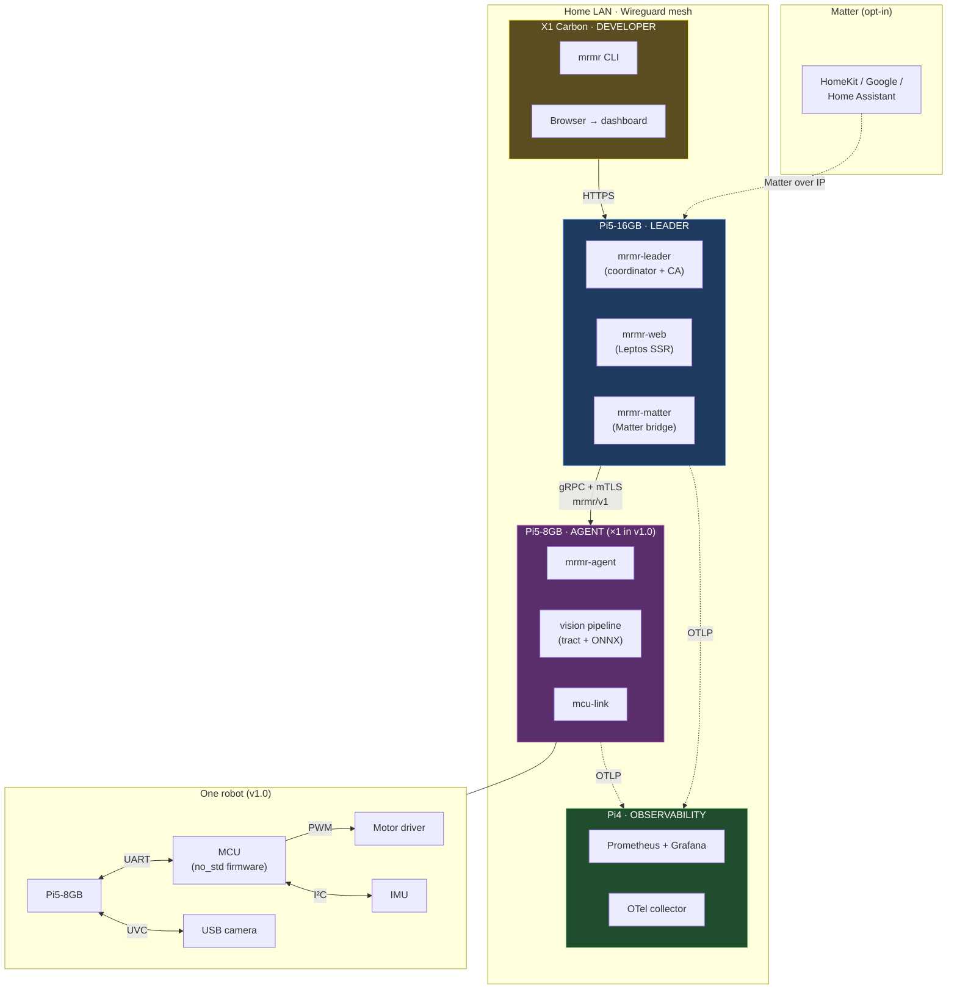
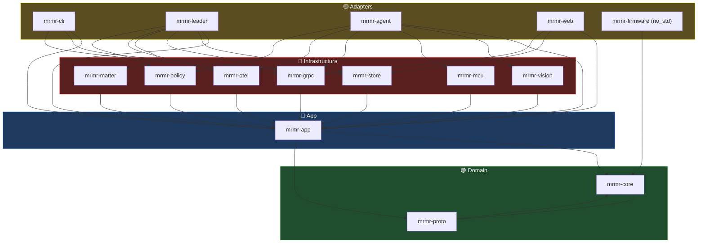
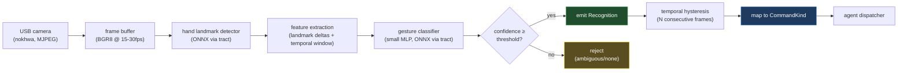

# MurMur — A Swarm-Capable Robotics Coordination Platform in Rust

> **mrmr** /ˈmɜːrmɜːr/ — a coordinated, distributed action emerging from
> many small voices.
>
> A homophone of *Murmuration* (a starling flock's emergent flight) and
> a nod to the author's surname. Binary prefix: `mrmr`. Wire protocol:
> `mrmr/v1`. **License:** Apache-2.0 OR MIT.

---

## 1. Vision

MurMur is an open, standards-grade coordination platform for small fleets
of edge-resident robots. It runs on commodity Linux SBCs (Raspberry Pi
class) with embedded MCUs (RP2040 / ESP32-C3) handling real-time actuator
and sensor work. Robots act individually under operator command, respond
to ASL gesture commands recognized through their own cameras, or
coordinate as a swarm to execute a shared mission.

**Three distinguishing properties.**

1. **Protocol-first.** The wire protocol (`mrmr/v1`, defined in Protobuf)
   is versioned, documented, and treated as a public contract from day
   one. The Rust implementation in this repository is *one* conformant
   implementation; others are welcome.
2. **Tree-architected.** A pure domain core depends on nothing.
   Application logic depends on the domain. Infrastructure depends on
   both. Adapters depend on everything below them. The dependency rule
   is enforced by the Cargo workspace and verified in CI.
3. **Edge-native, not cloud-dependent.** MurMur runs entirely on a home
   network. No external service is required for any feature. Optional
   integrations (Matter, OTel export, OTA update) are explicit, opt-in,
   and isolated behind ports.

This document is the **specification**. It is paired with
`00-curriculum-overview.md`, the learning roadmap, which sequences
construction so each phase teaches a clean slice of Rust.

---

## 2. Glossary

| Term | Meaning |
|---|---|
| **Agent** | The Rust daemon on each robot's Pi. One agent per robot. |
| **Leader** | The Rust daemon on the Pi5-16GB. Coordinates agents; hosts the web dashboard and Matter bridge. |
| **Mission** | A typed, persisted plan describing actions for one or more agents. |
| **Command** | A unit of intent within a mission — "move forward 30cm", "wave", "halt". |
| **Gesture** | A recognized ASL sign from the v1.0 closed vocabulary, mapped to a `CommandKind`. |
| **Telemetry** | Time-series data emitted by agents (battery, IMU, motor state). |
| **Operator** | A human user, interacting via web dashboard, CLI, or Matter controller. |
| **Cluster** | All reachable nodes in a deployment (1 leader + N agents + 1 observability). |
| **Protocol** | The `mrmr/v1` wire format, defined in `mrmr-proto/src/v1.proto`. |
| **Engine** | The Rust workspace producing all binaries. |

---

## 3. Goals & Non-Goals

### v1.0 — must ship by month 18

1. **One physical robot**, chassis printed on Bambu A1 mini, differential-drive base, MCU-controlled actuator layer running mrmr firmware in `no_std` Rust.
2. **`mrmr-leader`** running on Pi5-16GB; **`mrmr-agent`** running on the robot's Pi5-8GB; **observability stack** running on Pi4. Leader↔agent over mTLS gRPC.
3. **ASL recognition**: 10–15 chosen command signs, single-signer view, explicit confidence thresholds, visible reject path.
4. **Web dashboard** (Leptos SSR + islands) showing live agent status, mission history, live camera feed with classifier overlay, and operator controls.
5. **Matter integration**: each robot registers as `OnOff` + `OccupancySensing` clusters; controllable from any Matter controller on LAN.
6. **Operator CLI** (`mrmr`): `init`, `enroll`, `dispatch`, `status`, `tail`, `gesture-test`, `cert`.
7. **Multi-agent-ready architecture and operations**:
   - The protocol, leader, and CLI all support N agents from day one.
   - Enrollment and certificate issuance flow are built and tested.
   - **`docs/OPERATIONS.md`** documents the onboarding runbook for adding agents 2 and 3 (or N), including hardware prep, network config, cert enrollment, troubleshooting, and verification tests.
   - The flow is exercised end-to-end with at least one *test* second agent (could be a second Pi running a stub firmware, or even a Linux VM running `mrmr-agent` with a mock McuLink) before v1.0 is declared done.
8. **Hardened production posture**: mTLS everywhere, AppArmor profiles, systemd units with restricted capabilities, signed releases, minimal attack surface.
9. **NIST 800-82 + NIST 800-213** control mapping documented in `docs/COMPLIANCE.md` and audited against MurMur's actual configuration.
10. **Wire protocol** `mrmr/v1` published as a versioned spec with an RFC process and a conformance test suite.

### v2.0+ — explicit stretch

- Robots 2 and 3 *physically built* and operating in coordinated missions.
- Decentralized swarm primitives (no-leader formation, simple consensus on shared actions).
- GPUI desktop client (`mrmr-studio`) as alternative to web dashboard.
- Custom Matter cluster for richer robot semantics.
- Continuous (sentence-level) ASL recognition.
- OTA firmware updates from leader to MCUs.

### Explicit non-goals — will not build

- ROS / ROS2 compatibility. MurMur is parallel.
- General-purpose robotics platform. Targets *small home/lab fleets*.
- Cloud-only operation. Cloud is opt-in, never required.
- Translation of arbitrary ASL. v1.0 is *closed-vocabulary command recognition*, not language translation. This boundary is a public promise.
- Formal Matter certification at v1.0.

---

## 4. System Topology



**Why leader-and-agents in v1.0?** Dramatically simpler to reason about,
debug, and secure. Decentralized primitives are v2.0, once the
distributed-systems chops are in. Building peer mesh on day one before
shipping a working leader is how robotics projects die.

---

## 5. Architecture: Tree-Layered Workspace

The dependency rule: **no outer-layer crate is ever imported by an
inner one**. Enforced by Cargo, verified by `cargo xtask check-arch`
in CI.

| Crate | Layer | Responsibility | Depends on |
|---|---|---|---|
| `mrmr-core` | 🟢 Domain | Pure types: `AgentId`, `MissionId`, `Command`, `Gesture`, `Status`, errors. | std, serde, jiff |
| `mrmr-proto` | 🟢 Domain | Versioned wire format. `.proto` + generated tonic types. *Treated as a public spec.* | std, prost, tonic |
| `mrmr-app` | 🔵 App | Use cases (`DispatchMission`, `EnrollAgent`, `ProcessGesture`) and ports (`AgentRegistry`, `MissionStore`, `VisionEngine`, `McuLink`, `MatterBridge`, `Clock`). Pure logic, zero I/O. | core, proto |
| `mrmr-vision` | 🔴 Infra | `VisionEngine`: camera capture, ONNX inference via `tract`. | core, app |
| `mrmr-mcu` | 🔴 Infra | `McuLink`: framed UART/USB-CDC protocol. | core, app |
| `mrmr-grpc` | 🔴 Infra | gRPC adapters; mTLS via rustls. | core, proto, app |
| `mrmr-store` | 🔴 Infra | `MissionStore` + `AgentRegistry` via `redb`. | core, app |
| `mrmr-matter` | 🔴 Infra | Matter bridge via `rs-matter`. | core, app |
| `mrmr-otel` | 🔴 Infra | OTel exporter; Prometheus metrics; `tracing`. | core, app |
| `mrmr-policy` | 🔴 Infra | Compliance controls as types; enforces config invariants at startup. | core, app |
| `mrmr-cli` | 🟡 Adapter | The `mrmr` binary. | core, app, store, grpc |
| `mrmr-leader` | 🟡 Adapter | The `mrmr-leader` binary. | core, app, store, grpc, matter, otel, policy |
| `mrmr-agent` | 🟡 Adapter | The `mrmr-agent` binary. | core, app, vision, mcu, grpc, otel, policy |
| `mrmr-web` | 🟡 Adapter | Leptos SSR dashboard, served by leader. | core, app, store, grpc |
| `mrmr-firmware` | 🟡 Adapter (no_std) | MCU firmware, Embassy-based async. | core (subset, feature `no_std`) |
| `xtask` | 🟡 Adapter | Custom build tasks (`check-arch`, codegen, release packaging). | std, walkdir |

**16 crates total.** All declared in the workspace at Week 1; we
materialize real code in roughly half by month 9, all by month 18.

### 5.1 Dependency rule, visualized



---

## 6. The `mrmr/v1` Protocol

Lives in `crates/mrmr-proto/src/v1.proto`. **Versioned independently of
the implementation.** Any change goes through an RFC process:

1. Open issue tagged `rfc:protocol`.
2. Draft `docs/rfcs/NNNN-short-title.md`.
3. Review window ≥ 7 days.
4. If accepted: bump `package mrmr.v1` to `mrmr.v2` for breaking
   changes; never modify v1 in a backward-incompatible way.

Backward compatibility within a major version follows
[Protobuf evolution rules](https://protobuf.dev/programming-guides/proto3/#updating).

### 6.1 Service surface (sketch)

```protobuf
syntax = "proto3";
package mrmr.v1;

service Coordinator {
  rpc Enroll(EnrollRequest) returns (EnrollResponse);
  rpc StreamTelemetry(stream TelemetryFrame) returns (Ack);
  rpc Dispatch(DispatchRequest) returns (stream Command);
  rpc ListAgents(google.protobuf.Empty) returns (AgentList);
  rpc ListMissions(MissionFilter) returns (MissionList);
  rpc CancelMission(MissionRef) returns (Ack);
}

service Vision {
  rpc ClassifyFrame(Frame) returns (Classification);
  rpc StreamRecognitions(stream Frame) returns (stream Recognition);
}
```

Generated Rust lives in `mrmr-proto/src/generated/` (committed; not
regenerated at build time — slower and bites people without `protoc`).

### 6.2 mTLS by default

Every gRPC channel is mTLS. **The leader is the CA at v1.0.** Certs are
issued via `mrmr enroll`, stored in `~/.mrmr/certs/`, expire at 90 days,
auto-renew at 60. v2.0 considers ACME and SPIFFE.

---

## 7. Domain Model (selected)

```rust
// In mrmr-core. No deps except serde + jiff.

pub struct AgentId(Ulid);
pub struct MissionId(Ulid);
pub struct CommandId(Ulid);

pub enum AgentStatus {
    Offline,
    Idle,
    Executing { mission: MissionId, step: u32 },
    Error { kind: AgentErrorKind, since: Timestamp },
}

pub enum CommandKind {
    Move { direction: Direction, distance_cm: u16 },
    Turn { direction: Rotation, degrees: u16 },
    Wave,
    Stop,
    Halt, // emergency, takes precedence
    Wait { duration: Duration },
    Acknowledge { gesture: GestureKind },
    Custom { name: SmolStr, payload: Bytes },
}

pub enum GestureKind {
    Hello, Stop, Go, Forward, Back, Left, Right,
    Together, Wait, Help, Yes, No, Acknowledge, Cancel,
    // Frozen at v1.0 — additions go through RFC
}

pub struct Mission {
    pub id: MissionId,
    pub created: Timestamp,
    pub origin: MissionOrigin, // Operator | Gesture | Automation | Matter
    pub steps: Vec<MissionStep>,
    pub assignment: Assignment, // Single(AgentId) | Broadcast | Quorum(usize)
}

#[derive(thiserror::Error, Debug)]
pub enum DomainError { /* … */ }
```

The `Slug`-style validated newtype pattern applies here: `AgentId::new`
validates ULID format; invalid IDs are unrepresentable downstream.

---

## 8. Vision Pipeline (ASL Gesture Recognition)

Runs entirely on the agent (each robot has its own camera and
classifier). Pipeline:



**Honesty about scope.** v1.0 promises *closed-vocabulary command
recognition* of 10–15 isolated signs from a clear, single-signer view.
This is not "ASL translation" and the documentation will say so. Bias
across skin tone, hand size, and regional signing variants is a known
problem in the literature; v1.0 ships with a written limitations
section, model card, and a path for users to provide feedback. Real
inclusion of Deaf signers in dataset curation is v2.0+ work.

**Implementation order (see curriculum):** weeks 12–15 build the camera
and frame pipeline; weeks 30–34 add ONNX inference; weeks 35–37 add the
classifier and hysteresis logic.

---

## 9. Matter Integration

Each robot registers as **two clusters** in v1.0:

- `OnOff` — robot active vs idle.
- `OccupancySensing` — robot reports presence detected via vision.

Implementation via `rs-matter` (project-chip's Rust implementation).
Wrapped behind a `MatterBridge` port in `mrmr-app` so the rs-matter API
churn (it's pre-1.0) doesn't ripple. Custom clusters → v2.0.

The leader runs a single Matter accessory exposing each robot as a
sub-device. From an operator's HomeKit / Google Home / Home Assistant
view, MurMur looks like a normal Matter bridge with N child devices.

---

## 10. Web Dashboard (Leptos SSR + Islands)

Served by `mrmr-leader` (or as a sidecar process — TBD in week 26
when we get there).

**Pages:**
- `/` — cluster overview, agent grid, recent missions.
- `/agents/:id` — telemetry charts, current mission, live camera with
  classifier overlay (SSE stream).
- `/missions` — mission log, filterable, searchable.
- `/missions/:id` — mission detail, step-by-step status.
- `/gestures` — vocabulary reference, live gesture-test mode.
- `/automations` — declarative rules engine UI.
- `/system` — node health, certs, releases.

**Architecture:**
- Most routes are server-rendered (fast first paint).
- Live data via SSE from `/api/v1/events` (multiplexed event stream).
- Interactive bits (mission step controls, automation editor) are
  hydrated islands.
- Auth: session cookie + WebAuthn (FIDO2) for operator login. CLI uses
  client cert auth.

---

## 11. Security & Compliance

### 11.1 Defense in depth

1. **Identity:** every node has a unique mTLS cert issued by the leader's CA.
2. **Network:** Wireguard mesh between Pis (defense for cleartext leaks).
3. **Authz:** capability-based — each cert encodes its grants in extensions.
4. **OS hardening:** systemd units with `ProtectSystem=strict`, `PrivateUsers=true`, `CapabilityBoundingSet=`, AppArmor profiles per binary.
5. **Supply chain:** `cargo-deny` (CVEs, licenses, sources), reproducible-ish builds with `--locked`, signed release artifacts, SBOM via `cargo-sbom`.
6. **Runtime:** `mrmr-policy` checks invariants at startup (e.g., refuses to start if certs in plaintext, refuses to bind to 0.0.0.0 without explicit flag).

### 11.2 Compliance posture

`docs/COMPLIANCE.md` (built progressively in weeks 41–42) maps
MurMur's controls to:

- **NIST 800-82r3** (Operational Technology / ICS Security) — MurMur is a small ICS.
- **NIST 800-213 / 213A** (IoT Device Cybersecurity Capabilities).
- **NIST 800-53 moderate baseline** subset, applied to engine repo + CI.
- **CIS Linux Benchmarks** for the Pi nodes.
- **SOC 2 Type 2** control families — design and tabletop, not formal audit.
- **GDPR** — only relevant if telemetry export is enabled and exits the LAN.

HIPAA is **not** practiced by MurMur (no PHI). If still desired, see
the curriculum's third-capstone option.

---

## 12. CI/CD Pipeline

**Engine repo CI runs on every push:**

1. `cargo fmt --check`
2. `cargo clippy --all-targets --all-features -- -D warnings`
3. `cargo test --workspace --all-features`
4. `cargo deny check`
5. `cargo xtask check-arch` (verifies dependency rule)
6. Conventional-commit lint on PR titles
7. `cargo audit`
8. **(week 41+)** SBOM generation + sign

**Release pipeline (week 52):**

1. Tag `vX.Y.Z` triggers cross-compilation matrix:
   - `aarch64-unknown-linux-gnu` (Pi5/Pi4)
   - `armv7-unknown-linux-gnueabihf` (older Pis, optional)
   - `thumbv6m-none-eabi` (RP2040 firmware)
   - `riscv32imc-unknown-none-elf` (ESP32-C3 firmware, if used)
2. Artifacts signed with cosign.
3. Release notes generated from conventional commits via `git-cliff`.

---

## 13. Operational Readiness

**v1.0 ships these documents** alongside the code:

- `docs/OPERATIONS.md` — onboarding runbook for adding agents 2–N. Walks through hardware prep, OS image flashing, network config, certificate enrollment, agent installation, verification tests, and troubleshooting.
- `docs/INCIDENT-RESPONSE.md` — what to do when a robot misbehaves: emergency halt, log collection, telemetry capture, post-mortem template.
- `docs/PROTOCOL.md` — the `mrmr/v1` protocol reference for external implementers.
- `docs/COMPLIANCE.md` — control mapping (NIST 800-82, 800-213, etc.).
- `docs/SECURITY.md` — security model, threat model, vulnerability disclosure address.
- `docs/CONTRIBUTING.md` — code style, RFC process, commit conventions, DCO.
- `docs/CODE_OF_CONDUCT.md` — Contributor Covenant 2.1.
- `docs/GOVERNANCE.md` — how decisions are made (BDFL → council, depending on adoption).

**v1.0 acceptance criteria includes:** a fresh maintainer follows
`OPERATIONS.md` from a clean Pi image and successfully enrolls a *test*
second agent (real Pi or VM) without help. If the runbook is unclear,
v1.0 isn't done.

---

## 14. Versioning & Standards Posture

- **License:** Apache-2.0 OR MIT (Rust-ecosystem dual). Both `LICENSE-APACHE` and `LICENSE-MIT` files at repo root.
- **DCO** (Developer Certificate of Origin) for contributions. No CLA.
- **SemVer** for crates. Implementation versions independent of protocol version.
- **Protocol versioning:** `mrmr/v1` is the v1.0 deliverable. Breaking changes mint `mrmr/v2`. Multiple versions can be supported in one binary; deprecation policy: 6-month overlap minimum.
- **Conformance test suite** at `crates/mrmr-conformance` — language-agnostic test vectors + a Rust runner. Other implementations can run the suite to claim conformance.

---

## 15. Repository Conventions

```
mrmr/
├── Cargo.toml              ← workspace manifest
├── rust-toolchain.toml     ← channel pin (1.95.0)
├── deny.toml               ← supply-chain rules
├── clippy.toml             ← lint config
├── prek.toml               ← pre-commit hooks (managed by prek)
├── LICENSE-APACHE
├── LICENSE-MIT
├── README.md
├── crates/
│   ├── mrmr-core/
│   ├── mrmr-proto/
│   ├── mrmr-app/
│   ├── mrmr-vision/
│   ├── mrmr-mcu/
│   ├── mrmr-grpc/
│   ├── mrmr-store/
│   ├── mrmr-matter/
│   ├── mrmr-otel/
│   ├── mrmr-policy/
│   ├── mrmr-cli/
│   ├── mrmr-leader/
│   ├── mrmr-agent/
│   ├── mrmr-web/
│   ├── mrmr-firmware/
│   └── mrmr-conformance/
├── xtask/
├── docs/
│   ├── SPEC.md             ← this file
│   ├── PROTOCOL.md
│   ├── OPERATIONS.md
│   ├── INCIDENT-RESPONSE.md
│   ├── COMPLIANCE.md
│   ├── SECURITY.md
│   ├── CONTRIBUTING.md
│   ├── CODE_OF_CONDUCT.md
│   ├── GOVERNANCE.md
│   └── rfcs/
├── hardware/
│   ├── chassis-v1/         ← STL files for Bambu A1 mini
│   └── BOM.md              ← bill of materials
├── templates/              ← kickstart scaffolding templates
│   ├── workspace-skeleton/
│   ├── domain-crate/
│   ├── port-and-adapter/
│   └── grpc-service/       ← (added as patterns mature)
└── .github/
    └── workflows/
        ├── ci.yml
        ├── release.yml
        └── codeql.yml
```

**Branching:** trunk-based. `main` always green. Feature branches → PR
→ squash-merge. Branch protection enforces CI green + signed commits +
linear history.

**Commits:** Conventional Commits 1.0.0, scope = crate name.
Example: `feat(grpc): add streaming dispatch with backpressure`.

---

## 16. v1.0 → v2.0+ Roadmap

| Milestone | Target | Deliverable |
|---|---|---|
| **M0** | Month 1 | Workspace skeleton, CI green, foundation. |
| **M1** | Month 4 | Core types, app ports, CLI hello-world. |
| **M2** | Month 7 | Leader + agent talking gRPC + mTLS, single-machine. |
| **M3** | Month 9 | Web dashboard skeleton, telemetry SSE. |
| **M4** | Month 11 | MCU firmware moving a motor under leader command. |
| **M5** | Month 13 | Robot 1 fully built; chassis printed; agent on-robot. |
| **M6** | Month 15 | Vision pipeline + ASL gesture vocabulary working. |
| **M7** | Month 16 | Matter bridge live, controllable from HomeKit. |
| **M8** | Month 17 | Hardening pass, compliance docs, signed releases. |
| **M9** | Month 18 | **v1.0** — `OPERATIONS.md` validated by enrolling a test second agent. |
| **v1.1** | Month 21 | Robot 2 physically built, multi-agent missions exercised. |
| **v1.2** | Month 24 | Robot 3, GPUI desktop client, custom Matter cluster. |
| **v2.0** | Month 30 | Decentralized swarm primitives, OTA firmware. |

This is the line. We will deviate; we will not abandon.

---

*MurMur — hum together, move together.*
