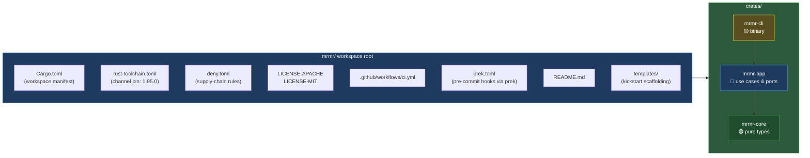
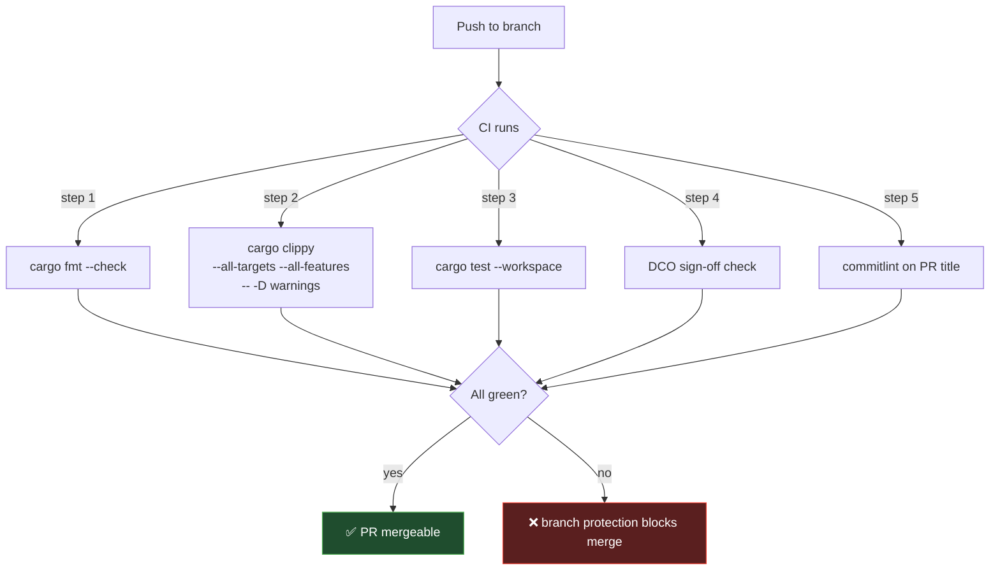

# Week 1 — Foundations: Workspace, Toolchain, CI, Git Discipline

> **Read this end-to-end before opening Zed.** Every Rust project you ship
> for the rest of your career will start with the decisions in this
> document. Get them right once, internalize the reasoning, and you'll
> never have to think about most of them again.

---

## 1. What You're Building This Week

A Cargo **workspace** named `mrmr` with three skeleton crates, **CI green
from the first push**, **dual-license** files in place, **conventional
commits** enforced in CI, and **pre-commit hooks** running `fmt` + `clippy`
locally.



You will **not** create all sixteen crates from `SPEC.md` this week. Three
is enough to feel the workspace shape and let the dependency rule
(adapter depends on app depends on domain; never the reverse) start to
feel physical.

---

## 2. Why a Workspace?

Cargo lets you build a single crate, and that's where most newcomers
stay. But the moment a project grows past ~3000 lines, three pressures
arrive:

1. **Compilation time** — touching one file recompiles everything.
2. **Architectural drift** — without enforced module boundaries, the
   `mod` graph becomes a hairball.
3. **Reusability** — pieces of one binary should be testable as
   libraries.

A **workspace** is Cargo's answer. It is one repository, one
`Cargo.lock`, one `target/` directory, but many crates that depend on
each other through `Cargo.toml` declarations rather than through `mod`
paths.

**The architectural payoff is the bigger one.** A workspace lets you
encode the dependency rule of your architecture *in the build system
itself*. If `mrmr-core` does not depend on `mrmr-app`, then no code in
`mrmr-core` can call into `mrmr-app` even by accident. The compiler
will refuse. This is **architecture as a compile-time invariant** — a
Tree Architecture core principle, made physical by Cargo.

### What this looks like in `Cargo.toml`

```toml
# /mrmr/Cargo.toml — the WORKSPACE manifest (not a crate)
[workspace]
resolver = "3"
members = [
  "crates/mrmr-core",
  "crates/mrmr-app",
  "crates/mrmr-cli",
]

[workspace.package]
edition = "2024"
rust-version = "1.95"
license = "Apache-2.0 OR MIT"
authors = ["Your Name <you@example.com>"]
repository = "https://github.com/<you>/mrmr"

[workspace.dependencies]
# Versions declared here, referenced by `.workspace = true` in member crates.
serde     = { version = "1", features = ["derive"] }
thiserror = "2"
ulid      = { version = "1", features = ["serde"] }
jiff      = { version = "0.2", features = ["serde"] }
tracing   = "0.1"
```

**Why `workspace.dependencies`?** Because diamond dependencies (two of
your crates pulling different versions of `serde`) are a real failure
mode. Centralizing version declarations forces intentional choices.

**Why `resolver = "3"`?** It's the modern feature resolver, on by
default in 2024 edition. Fixes long-standing edge cases around feature
unification across dependency-vs-build-dependency contexts. You don't
need to know the details yet; "use the latest resolver" is the right
default.

---

## 3. The Toolchain Pin (`rust-toolchain.toml`)

Rust ships a new stable release every 6 weeks. New language features,
new lint rules, sometimes minor behavior changes. If you don't pin the
toolchain, your CI will use whatever rustc happened to be installed on
the runner *that day* — non-reproducible, will eventually bite.

```toml
# /mrmr/rust-toolchain.toml
[toolchain]
channel    = "1.95.0"
components = ["rustfmt", "clippy", "rust-src"]
profile    = "minimal"
```

When anyone (you, CI, a future contributor) runs *any* cargo command in
this directory, `rustup` reads this file and installs/uses exactly Rust
1.95.0. Reproducible builds start here.

> **Senior reflection.** Pinning is in tension with staying current.
> The discipline: **pin in the file, bump deliberately**. Every 6–12
> weeks, bump the channel, run the full test suite, fix new clippy
> lints, commit the bump as its own commit. You never bump *by
> accident* because someone ran `rustup update`.

---

## 4. The Lint Wall

Clippy is Rust's idiom enforcer. Default lints catch obvious mistakes;
*pedantic* and *nursery* groups catch design smells. We turn on a
curated subset.

```toml
# Add to /mrmr/Cargo.toml
[workspace.lints.rust]
unsafe_code = "deny"   # we'll relax this only inside audited modules later

[workspace.lints.clippy]
pedantic   = { level = "warn", priority = -1 }
nursery    = { level = "warn", priority = -1 }
unwrap_used  = "warn"
expect_used  = "warn"
panic        = "warn"
todo         = "warn"
dbg_macro    = "deny"
print_stdout = "warn"  # we use `tracing`, not println
print_stderr = "warn"
```

Then each member crate adds:

```toml
# crates/mrmr-core/Cargo.toml
[lints]
workspace = true
```

**Why `unsafe_code = "deny"` at the workspace level?** Because most of
your code has no business being unsafe. The crates that legitimately
need it (eventually `mrmr-mcu` for hardware FFI, perhaps) will opt in
with `#![allow(unsafe_code)]` and an audit comment. Default-deny +
explicit-allow is the Rust idiom.

**Why warn on `unwrap`/`expect`?** They panic. Library code should
never panic on normal control flow. We'll learn the proper pattern
(`Result` + `?` + `thiserror`) in Week 5.

---

## 5. Dual-License Setup (Apache-2.0 OR MIT)

This is the Rust-ecosystem standard for a reason. Two files at repo
root: `LICENSE-APACHE` and `LICENSE-MIT`. Both are short; copy from
`https://www.apache.org/licenses/LICENSE-2.0.txt` and the MIT template.

In every crate's `Cargo.toml`:

```toml
license = "Apache-2.0 OR MIT"
```

In every source file's top-level doc comment (week 2 onward):

```rust
//! mrmr-core — pure domain types for MurMur.
//!
//! Licensed under either of Apache-2.0 OR MIT at your option.
```

**Why dual?** MIT is permissive and compatible with everything; Apache
includes an explicit patent grant that matters for adoptable
standards. Letting consumers pick gives MurMur the broadest reach.

**The README needs a license footer:**

```markdown
## License

Licensed under either of:

- Apache License, Version 2.0 ([LICENSE-APACHE](LICENSE-APACHE) or
  http://www.apache.org/licenses/LICENSE-2.0)
- MIT license ([LICENSE-MIT](LICENSE-MIT) or
  http://opensource.org/licenses/MIT)

at your option.

### Contribution

Unless you explicitly state otherwise, any contribution intentionally
submitted for inclusion in the work by you, as defined in the Apache-2.0
license, shall be dual licensed as above, without any additional terms
or conditions.
```

That last paragraph is the standard inbound-license language; it
combines with DCO sign-off (we'll add the DCO check in W6) to keep
contribution clean.

---

## 6. Git as Documentation

You'll write thousands of commits across MurMur. Every one is a note
to your future self. Optimize for **readability at `git log
--oneline` scale** *and* at **`git show <sha>` scale**.

### Conventional Commits

```
<type>(<scope>): <subject>

<body — the why>

<footer — issue refs, breaking changes>
```

**Types**: `feat`, `fix`, `refactor`, `perf`, `docs`, `test`, `build`,
`chore`.

**Scope**: usually the crate name without the `mrmr-` prefix.
`feat(core): add AgentId newtype`.

**Subject**: imperative mood, ≤72 chars, no trailing period.

✅ `feat(core): add AgentId newtype with validated constructor`
❌ `Added an agent id` (past tense, no scope, no type)
❌ `feat: stuff` (vacuous)

**Body** answers *why*. The diff already shows *what*.

```
feat(core): add AgentId newtype with validated constructor

An AgentId wraps a Ulid. We model it as a newtype rather than a raw
Ulid so the type system distinguishes agents from missions or commands
elsewhere. Validation lives in `AgentId::new`, the only constructor.

Rejected the alternative of using Ulid directly throughout the codebase
because it violates "make illegal states unrepresentable" — every
consumer would have to remember which kind of id this is.
```

That body is a love letter to whoever maintains this in 2028.

### Branching

Trunk-based. `main` always green. Every change is a branch + PR +
squash-merge.

Branch naming: `<type>/<short-kebab-summary>`

- `feat/agent-id-newtype`
- `fix/cli-help-typo`
- `refactor/extract-mission-store-port`
- `chore/bump-rust-1.96`

### Why squash-merge

You will commit messily on a branch — `wip`, `more wip`, `oops`. That
mess is fine; it's how thinking works. But `main` should never see it.
**Squash on merge** so each PR becomes *one* clean commit on `main`,
PR title becoming the squash subject (must be a conventional commit)
and PR description becoming the body.

Result: `git log --oneline main` is clean, semantic, parseable.
`git-cliff` can auto-generate changelogs from it.

### DCO sign-off

We use the **Developer Certificate of Origin** (no CLA). Every commit
must end with:

```
Signed-off-by: Your Name <your@email>
```

Add automatically with `git commit -s`. Configure once: `git config
format.signoff true` in this repo.

CI will reject commits without a sign-off line.

---

## 7. CI From Day One

CI means: every push runs the full quality gate. *Every* push. *Even on
your own branches.* The discipline is non-negotiable because the moment
"I'll just check it locally first" becomes the rule, the gate decays.

### What the gate enforces (Week 1)



Cache `target/` between runs with `Swatinem/rust-cache@v2`. Otherwise
CI takes 8 minutes per push and you'll grow to hate it.

### Branch protection on `main`

In repo settings, require:

- All status checks pass.
- PR title matches conventional commit format.
- Squash merge is the only allowed merge method.
- Linear history.
- Signed commits (`git commit -S`, separate from DCO sign-off — yes,
  belt and suspenders).

This is where "build great software" becomes *enforced mechanism*.
Habit decays; mechanism doesn't.

---

## 8. Local Pre-Commit Hooks with `prek`

CI catches problems on push. Pre-commit hooks catch them before they
become commits. Faster feedback, less wasted CI minutes, less pollution
of your `git log` with `fix: actually format properly` commits.

We use **`prek`** — a Rust-native, drop-in replacement for the venerable
Python `pre-commit`. Three reasons it's the right call here:

1. **Single binary, no Python required.** Cross-platform, fast install.
2. **Drop-in compatible** with `.pre-commit-config.yaml` (the de facto
   industry standard format), so anything you learn here transfers to
   the wider ecosystem.
3. **Workspace-aware.** Built-in monorepo support — relevant the moment
   we have multiple crates with different concerns.

Used in production by CPython, FastAPI, Apache Airflow. Authored by
@j178; current stable is in the 0.3.x range.

### Install

```bash
# Pick whichever installer matches your environment.
# Standalone shell installer (Linux/macOS):
curl --proto '=https' --tlsv1.2 -LsSf \
  https://github.com/j178/prek/releases/latest/download/prek-installer.sh | sh

# Or via cargo:
cargo install prek

# Or via uv (if you use uv):
uv tool install prek
```

Verify: `prek --version` should print 0.3.x or newer.

### Configure

Two formats are supported. The legacy `.pre-commit-config.yaml` (works
with both prek and the original pre-commit) and prek's native
`prek.toml`. **For MurMur we use `prek.toml`** — it's terser, it's the
forward direction, and it's TOML which we already use everywhere else.

```toml
# /mrmr/prek.toml
[[repos]]
repo = "local"
[[repos.hooks]]
id          = "cargo-fmt"
name        = "cargo fmt"
language    = "system"
entry       = "cargo fmt --all --check"
files       = '\.rs$'
pass_filenames = false

[[repos.hooks]]
id          = "cargo-clippy"
name        = "cargo clippy"
language    = "system"
entry       = "cargo clippy --all-targets --all-features -- -D warnings"
files       = '\.rs$'
pass_filenames = false

[[repos]]
repo = "https://github.com/pre-commit/pre-commit-hooks"
rev  = "v6.0.0"
[[repos.hooks]]
id = "trailing-whitespace"
[[repos.hooks]]
id = "end-of-file-fixer"
[[repos.hooks]]
id = "check-yaml"
[[repos.hooks]]
id = "check-toml"
[[repos.hooks]]
id = "check-added-large-files"
```

### Activate

```bash
prek install            # writes the git pre-commit hook shim
prek install-hooks      # pre-fetches the remote hook repos
prek run --all-files    # smoke-test: run all hooks on the whole repo
```

From now on, `git commit` runs prek's hooks. A failing hook blocks
the commit.

### Bypass policy

`git commit --no-verify` *exists*. You will be tempted. **Don't.**
Bypassing the hook is a signal to yourself that something is wrong
with the work — either the hook or the work. Investigate, don't
shortcut. The exception is genuine emergency hot-fixes; in normal
flow the bypass should never be used. CI is the safety net that
catches you when discipline slips, but discipline is the system.

### Defense in depth

| Layer | Speed | Bypassable | Authority |
|---|---|---|---|
| `prek` pre-commit | seconds | yes (`--no-verify`) | local |
| CI workflow on push | minutes | no (CI runs on the server) | repo |
| Branch protection on `main` | n/a | no (admin override only) | GitHub |

Three layers. If one fails, the next catches it. The architecture is
the *combination*, not any single piece.

---

## 9. Templates with `kickstart`

A pattern we'll establish in Week 1 and use for the next 18 months:
**when an architectural pattern proves itself, extract it into a
kickstart template before you forget why it was shaped that way**.

`kickstart` (Keats/kickstart) is a Rust-native, language-agnostic
scaffolding tool by Vincent Prouillet — the same author who built
Tera (the templating engine kickstart uses) and Zola (the static site
generator). One TOML file describes the questions; Tera renders the
files. Single binary, no runtime dependencies.

### Why kickstart in this stack specifically

We're already swimming in TOML: `Cargo.toml`, `rust-toolchain.toml`,
`deny.toml`, `clippy.toml`, `prek.toml`. Adding a tool whose
configuration is also TOML (`template.toml`) means *one* config-language
mental model across the whole project. The cognitive savings are real
across an 18-month build.

It's also a Rust-ecosystem citizen: maintained by a respected Rust
author, MIT-licensed, used in production by templates Keats himself
publishes. Tera is a templating language you'll meet again
independently — learning it once pays compound interest.

The trade-off honestly: kickstart's value types are limited to
**string, integer, and boolean**. No native list / multi-select.
For our needs that's fine — we'll structure templates around boolean
flags rather than checklists.

### Why this matters at *senior* engineering level

Junior engineers copy-paste from a previous project when starting a
new one. They miss things. They drift. Two months in, the new project
has lost the architectural shape of the old one because two key
decisions weren't carried over.

Senior engineers extract templates. The act of writing a template
forces you to articulate *what* the pattern is and *why* each piece
exists. The template becomes documentation that *executes*. Six
months later when you start project #3, the template hands you a
correctly-shaped foundation in 30 seconds.

The honest version of "I know how to architect a Rust project" is
"I have a kickstart template that captures the shape, and I can
defend every choice in it to a senior reviewer."

### Install

```bash
cargo install kickstart --features=cli
```

Verify: `kickstart --version` prints 0.5.0 or newer.

### What a kickstart template looks like

A template is a directory with a `template.toml` at its root plus
the files-to-be-rendered. Tera (`{{ var }}`, ``, filters
like `| kebab_case`) is used in both file *contents* and file/dir
*names*.

```toml
# templates/workspace-skeleton/template.toml
name = "Rust workspace skeleton (MurMur-style)"
description = "Tree-architected Cargo workspace with prek + CI + dual license"
kickstart_version = 1
authors = ["Your Name <you@example.com>"]
keywords = ["rust", "workspace", "tree-architecture"]

# Files we don't want copied into the generated project.
ignore = ["README.md"]

# Run after questions are answered, before generation. Good for
# extra validation. (Hooks are templated executable scripts; we
# can leave this empty for v1.)
pre_gen_hooks = []

# Run after generation. Useful for `git init`, etc.
post_gen_hooks = [
    { name = "init git", path = "init_git.sh" },
]

[[variables]]
name       = "project_name"
default    = "my-project"
prompt     = "What is the name of this project? (kebab-case)"
validation = "^[a-z][a-z0-9-]+$"

[[variables]]
name    = "project_slug"
default = "{{ project_name | kebab_case }}"
derived = true

[[variables]]
name    = "binary_prefix"
default = "{{ project_name | replace(from='-', to='') | truncate(length=4, end='') }}"
prompt  = "Binary prefix (short, lowercase)"

[[variables]]
name   = "authors_line"
prompt = "Authors line (Name <email>)"

[[variables]]
name    = "edition"
default = "2024"
prompt  = "Rust edition"
choices = ["2024", "2021"]

[[variables]]
name    = "rust_version"
default = "1.95.0"
prompt  = "Pinned Rust toolchain version"

[[variables]]
name    = "license"
default = "Apache-2.0 OR MIT"
prompt  = "License"
choices = ["Apache-2.0 OR MIT", "MIT", "Apache-2.0", "AGPL-3.0-or-later"]

[[variables]]
name    = "include_prek"
default = true
prompt  = "Include prek pre-commit configuration?"

[[variables]]
name    = "include_cargo_deny"
default = true
prompt  = "Include cargo-deny configuration?"

[[variables]]
name   = "description"
prompt = "Short description of the project"
```

The corresponding files in the template directory are placed at
their destination paths with **Tera-templated names**. Examples:

- `Cargo.toml` — top of file:
  ```toml
  [workspace]
  resolver = "3"
  members = [
    "crates/{{ project_name }}-core",
    "crates/{{ project_name }}-app",
    "crates/{{ project_name }}-cli",
  ]
  ```
- `rust-toolchain.toml`:
  ```toml
  [toolchain]
  channel = "{{ rust_version }}"
  components = ["rustfmt", "clippy", "rust-src"]
  profile = "minimal"
  ```
- `crates/{{ project_name }}-cli/Cargo.toml`:
  ```toml
  [[bin]]
  name = "{{ binary_prefix }}"
  path = "src/main.rs"
  ```
- The `prek.toml` file is included in the template; if the user
  answered `include_prek = false`, we'd add it to `cleanup` so it gets
  removed after generation. (Cleanup syntax in §9 of kickstart's docs.)

### Run it

```bash
# From any directory:
kickstart /path/to/templates/workspace-skeleton -o ./my-new-project

# Or directly from a git repo:
kickstart https://github.com/you/mrmr -s templates/workspace-skeleton \
  -o ./my-new-project
```

That `-s` is short for `--sub-dir` — kickstart can pull a single
template out of a larger repo, which is exactly how we'll use this
during the project: the templates live inside `mrmr` and others can
fetch them by URL.

### Our rhythm

After each phase that produces a new architectural pattern, we ask:
**is this pattern likely to recur?**

- Workspace skeleton (Week 1): **yes** — we'll use it for every Rust
  workspace from now on. Extract.
- Adding a new domain crate (~Week 3): **yes** — we'll need several.
  Extract.
- Adding a new port-and-adapter pair (~Week 8): **yes** — every
  red-layer crate follows this shape. Extract.
- A specific algorithmic implementation: **no** — this is a one-off.
  Don't extract.

By the end of v1.0 we'll have 6–10 templates living in
`templates/`. Eventually they'll be promoted to a separate
`mrmr-templates` repo. For now: in-tree.

### What you'll do this week

1. Build the workspace by hand (Assignment 1.1). This is the *learn
   it* phase.
2. **Then** extract that exact workspace as your first kickstart
   template (Assignment 1.3). This is the *codify it* phase.

Order matters. Don't template before you understand. Don't fail to
template after you do.

---

## 10. The Three Crate Skeletons

The *shape*, not the implementation. You will write the actual code.

### `mrmr-core` — 🟢 the inner layer

```toml
# crates/mrmr-core/Cargo.toml
[package]
name         = "mrmr-core"
version      = "0.1.0"
edition.workspace      = true
rust-version.workspace = true
license.workspace      = true
description  = "Pure domain types for MurMur — agents, missions, commands, gestures."
repository.workspace   = true

[dependencies]
# Intentionally empty for now — domain has no dependencies.

[lints]
workspace = true
```

`lib.rs` is just a doc comment, one trivial item, and one passing test.

### `mrmr-app` — 🔵 the orchestration layer

```toml
[package]
name = "mrmr-app"
# ... same shape ...

[dependencies]
mrmr-core = { path = "../mrmr-core" }
```

That `path = "../mrmr-core"` is the dependency rule **made physical**.
`app` declares it depends on `core`. There is no way to write
`mrmr_app::foo` from inside `mrmr-core` because Cargo enforces
acyclic dependencies.

### `mrmr-cli` — 🟡 the outer layer (binary)

```toml
[package]
name = "mrmr-cli"
# ... same shape ...

[[bin]]
name = "mrmr"
path = "src/main.rs"

[dependencies]
mrmr-core = { path = "../mrmr-core" }
mrmr-app  = { path = "../mrmr-app" }
```

`main.rs` prints a hello message and exits. We're not writing real
logic this week; we're establishing the *skeleton* and the *pipeline*.

---

## 11. Anti-Patterns to Recognize

Now and forever:

| Smell | Why |
|---|---|
| One giant crate, all `mod`-based | No build-system enforcement of architecture. Drift inevitable. |
| `version = "*"` in deps | Non-reproducible builds. Sudden breakage when upstream releases. |
| `unwrap()` in library code | Panics on input you don't control = uptime bug waiting. |
| No CI, "I'll run tests locally" | The gate decays the moment one person ships without running them. |
| `git commit -m "wip"` on `main` | Commit history becomes archaeology, not documentation. |
| Toolchain unpinned | Future "it worked yesterday" mysteries. |
| Lints opt-in instead of default-deny | Code quality decays toward the laziest contributor's bar. |
| Direct merges to `main` | Branch protection bypassed = no ratchet. |
| Hooks only, no CI | Hooks are bypassable. CI is truth. |
| Single license without explicit choice | License compatibility ambiguity. The dual-license formula is mechanical for a reason. |

---

## 12. The Senior-Level "Why Behind the Why"

Pinning, lints, CI, branch protection, DCO — these feel like ceremony
when you're alone on a project. They are not. They are **the
apparatus that lets you trust your future self**. In six months, you
will return to this codebase having forgotten 80% of the design
rationale. The CI gate, the conventional commits, the doc comments —
these are the parts of your past self's mind that survive.

There's a deeper point. The reason senior engineers obsess over
process is that they have *seen* what happens without it: codebases
that compile but no one understands, deployments that work but no one
can reproduce, bugs that get fixed five times because no one
remembered the last fix. **Process is how you make engineering
knowledge persistent across time.**

For MurMur specifically: we're aspiring to a Rust open-source standard.
That means others will read this repo, fork it, possibly depend on its
protocol. They form opinions about the project's seriousness in the
first 30 seconds — based on what they see in `README.md`, `CI badge
green`, `LICENSE-*`, `git log`. The ceremony of week 1 is signaling
seriousness. That signal is *true* if the ceremony is.

---

## 13. Reading List for This Week

Total: ~3 hours. Spread across the week.

1. **The Rust Programming Language**, ch. 1 (Getting Started),
   ch. 2 (Guessing Game). Type the code yourself.
   <https://doc.rust-lang.org/book/>
2. **The Cargo Book**, "Workspaces" section — read all of it.
   <https://doc.rust-lang.org/cargo/reference/workspaces.html>
3. **Conventional Commits 1.0.0** — read once, bookmark forever.
   <https://www.conventionalcommits.org/en/v1.0.0/>
4. **Trunk Based Development** intro page.
   <https://trunkbaseddevelopment.com/>
5. **Developer Certificate of Origin** — short read, important to
   understand what you're attesting to.
   <https://developercertificate.org/>
6. **prek** quickstart — skim, then bookmark the configuration reference.
   <https://prek.j178.dev/quickstart/>
7. **kickstart** README — focus on the `template.toml` schema, the
   `[[variables]]` field options, and the available filters.
   <https://github.com/Keats/kickstart>
8. **Tera** docs — skim the built-in filters list (you'll use these
   inside templates).
   <https://keats.github.io/tera/docs/>

Skim, don't memorize. Know where these live so you can return to them
when a real question arises.

---

## 14. What Comes Next

Once your Week 1 assignments are submitted (CI green on a real GitHub
repo with conventional-commit + DCO checks passing, prek hooks active
locally, and the workspace skeleton extracted as a kickstart template),
and the quiz is reviewed, **Week 2 is ownership**. We move into
`mrmr-core` and write our first real Rust types — `AgentId`, `Status`
— and the borrow checker introduces itself. Lean in. That's where
Rust starts being Rust.

Now go open `week-01-assignments.md`.
